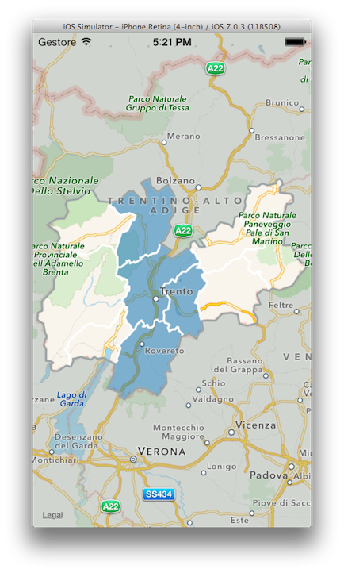

WDComprensoriTnMap
======

This component is part of a private project but I want to share my solution for creating a selectable area on Apple MKMapView.

I made the area borders using Google Earth and then exported these areas as .kmz files. Then, using a simply python script, I created the MKPolygons.

##License

This code is distributed under the terms and conditions of the [MIT license](LICENSE). 